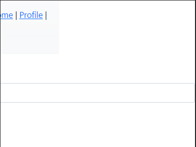

# Отчет по тестовому заданию

## Описание приложения

Приложение для создания постов, а также поиска постов

### Основные функции

1. Есть возможность регистрации и аунтентификация, с возможностью восстановить пароль. Пароль восстанавливается с помощью отправки писем на почту.
2. Можно редактировать в аккаунте почту и пароль, а также удалять аккаунт.
3. Есть возможность оформления подписки на месяц или на год.
4. Имеется возможность создавать редактировать и удалять посты
5. Просмотр постов и поиска постов по словам в теле или в названии поста

## Тестовый план

Проверим по очередности действия со всеми моделями, те с постами и юзерами. Для начала проверим страницу с подписками. Далее начнем проверять модель пользователей по CRUD.
Те проверим create read update delete поочереди. Посмотрим на создание пользователей и создание сессий. а также реализацию восстановления пароля. Далее проверим просмотр пользователей. Дальше идет проверка на редактирование пользователей. И наконец провека удаления. Также мы поступим с моделью постов. Проверки будут проходить для анонимных пользователей и для зарегистрированных. Также проверим взаимодействие между юзерами, те проверка безопасности деятельности пользователей. И под конец проверим верстку сайта

## Основные тест кейсы

1

***
Проверка отправка писем владельцу сайта для оформления подписки

Предисловие: Открыта страница поиска постов. Была пройдена аунтефикация.

Шаги

1. Нажать на ссылку в верхнем меню нажать на ссылку "plans & pricing" - ожидается: открытие страницы "plans & pricing" :heavy_check_mark:
2. Нажать на кнопку месячной подписки - ожидается: открытие приложения почты с адресом корпаративной почтой сайта :heavy_check_mark:
3. Нажать на кнопку месячной подписки - ожидается: открытие приложения почты с адресом корпоративной почтой сайта :heavy_check_mark:

***

2

***
Не прохождение авторизации для просмотра страницы "plans & pricing" поста анонимным пользователем

Предисловие: Открыта страница поиска постов. Не Была пройдена аунтефикация.

Шаги

1. Нажать на ссылку "plans & pricing" - ожидается: открытие страницы "Log in" и вывод сообщения "You need to sign in or sign up before continuing." :heavy_check_mark:

***

3

***
Регистрация

Предисловие: Открыта страница поиска постов. Не была пройдена аунтефикация.

Шаги

1. Нажать на ссылку "Sign up" - ожидается: открытие страницы "Sign up" :heavy_check_mark:
2. Ввести майл и пароль и подтверждение пароля - ожидается: поля доступны для ввода, данные вписаны и отображаются :heavy_check_mark:
3. Нажать кнопку "Sign up" - ожидается: Произошла аунтефикация. Открытие страницы просмотра постов. Вывод ссылок "Profile" и "Log out", а также удаление "Sign in" и "Sign up". Вывод надписи об успешном созданом пользователе "Welcome! You have signed up successfully." :heavy_check_mark:

***

4

***
Аунтефикация

Предисловие: Открыта страница поиска постов. Не была пройдена аунтефикация.

Шаги

1. Нажать на ссылку "Sign in" - ожидается: открытие страницы "Sign in" :heavy_check_mark:
2. Ввести майл и пароль - ожидается: поля доступны для ввода, данные вписаны и отображаются :heavy_check_mark:
3. Нажать кнопку "Log in" - ожидается: Произошла аунтефикация. Открытие страницы просмотра постов. Вывод ссылок "Profile" и "Log out", а также удаление "Sign in" и "Sign up". Вывод надписи об успешной аунтентификация "Signed in successfully." :heavy_check_mark:

***

5

***
Восстановление пароля с помощью отправки на почту ссылки для восстановления пароля с проверкой его изменения.

Предисловие: Открыта страница "Sign in" . Не была пройдена аунтефикация.

Шаги

1. Нажать на ссылку "Forgot your password?" - ожидается: открытие страницы "Forgot your password?" :heavy_check_mark:
2. Ввести майл - ожидается: поля доступны для ввода, данные вписаны и отображаются :heavy_check_mark:
3. Нажать на кнопку "Send me reset password instructions" - ожидается: открытие страницы "Log in" c выводом надписи об отправке письма "You will receive an email with instructions on how to reset your password in a few minutes." и отправка письма с ссылкой на смену пароля на почту указанную в форме :heavy_check_mark:
4. Нажать на ссылку смены пароля в письме - ожидается: Открытие страницы "Change your password" :heavy_check_mark:
5. Ввести новый пароль и подтверждение нового пароля - ожидается: поля доступны для ввода, данные вписаны и отображаются :heavy_check_mark:
6. Нажать на кнопку "Change my password" - ожидается: Произошла аунтефикация. Открытие страницы просмотра постов. Вывод ссылок "Profile" и "Log out", а также удаление "Sign in" и "Sign up". Вывод надписи об успешной аунтентификация "Your password has been changed successfully. You are now signed in." :heavy_check_mark:
7. Нажать кнопку "Log out" - ожидается: Открытие страницы просмотра постов. Вывод ссылок "Sign in" и "Sign up", а также удаление "Profile" и "Log out". Вывод надписи об успешном выходе "Signed out successfully." :heavy_check_mark:
8. Нажать ссылку "Sign in" - ожидается открытие страницы "Log in". :heavy_check_mark:
9. Ввести почту и новый пароль - ожидается: поля доступны для ввода, данные вписаны и отображаются :heavy_check_mark:
10. Нажать кнопку "Log in" - ожидается: Произошла аунтефикация. Открытие страницы просмотра постов. Вывод ссылок "Profile" и "Log out", а также удаление "Sign in" и "Sign up". Вывод надписи об успешной аунтентификация "Signed in successfully." :heavy_check_mark:

***

6

***
Просмотр страницы своего профиля

Предисловие: Открыта страница поиска постов. Была пройдена аунтефикация. Был создан хотя бы 1 пост от этого аккаунта

Шаги

1. Нажать на ссылку "Profile" - ожидается: открытие страницы "Profile". Вывод информации об аккаунте и вывод списка созданых им постов. :x: - полученный результат: открыте страницы "Edit User" - причина ошибки: отсутсвует route на users/show, а также Controller и View.

***

7

***
Редактирование пользователя с изменением почты и пароля

Предисловие: Открыта страница поиска постов. Была пройдена аунтефикация.

1. Нажать на ссылку "Profile" - ожидается: открытие страницы "Profile". Вывод информации об аккаунте. :x: - полученный результат: открыте страницы "Edit User" - причина ошибки: отсутсвует route на users/show, а также Controller и View.
2. Нажать кнопку "Edit User" - ожидается: открытие страницы "Edit User". :no_entry: проверка невозможна
3. Ввести новую почту, новый пароль с его подтверждением и текущий пароль - ожидается: поля доступны для ввода, данные вписаны и отображаются :heavy_check_mark:
4. Нажать на кнопку "Update" - ожидается: открытие страницы поиска постов. Вывод измененной почты в верхнем меню и вывод сообщения об успешном изменении страницы "Your account has been updated successfully." :heavy_check_mark:
5. Нажать кнопку "Log out" - ожидается: Открытие страницы просмотра постов. Вывод ссылок "Sign in" и "Sign up", а также удаление "Profile" и "Log out". Вывод надписи об успешном выходе "Signed out successfully." :heavy_check_mark:
6. Нажать ссылку "Sign in" - ожидается открытие страницы "Log in". :heavy_check_mark:
7. Ввести новую почту и новый пароль - ожидается: поля доступны для ввода, данные вписаны и отображаются :heavy_check_mark:
8. Нажать кнопку "Log in" - ожидается: Произошла аунтефикация. Открытие страницы просмотра постов. Вывод ссылок "Profile" и "Log out", а также удаление "Sign in" и "Sign up". Вывод надписи об успешной аунтентификация "Signed in successfully." :heavy_check_mark:

***

8

***
Удаление пользователя имеющего хотя бы один пост

Предисловие: Открыта страница поиска постов. Была пройдена аунтефикация. Был создан хотя бы 1 пост от этого аккаунта

1. Нажать на ссылку "Profile" - ожидается: открытие страницы "Profile". Вывод информации об аккаунте. :x: - полученный результат: открыте страницы "Edit User" - причина ошибки: отсутсвует route на users/show, а также Controller и View.
2. Нажать кнопку "Edit User" - ожидается: открытие страницы "Edit User". :no_entry: проверка невозможна
3. Нажать кнопку "Cancel My Account" - ожидается: открытие страницы с поиском постов( вместе с постом удаленного аккаунта или без него - зависит от ТЗ). Вывод ссылок "Sign in" и "Sign up", а также удаление "Profile" и "Log out". Вывод надписи об успешном удалении аккаунта "Bye! Your account has been successfully cancelled. We hope to see you again soon." :x: - полученный результат: ошибка об удалении аккаунта - причина ошибки: не прописана команда dependent: :delete_all для удаления постов, которые привязаны к удаляемому юзеру. Либо же написать optional: true для постов, тогда посты будут оставаться без пользователя
4. Нажать на ссылку "Sign in" - ожидается: открытие страницы "Sign in" :no_entry: проверка невозможна
5. Ввести майл и пароль - ожидается: поля доступны для ввода, данные вписаны и отображаются :no_entry: проверка невозможна
6. Нажать кнопку "Log in" - ожидается: Вывод сообщения "Invalid Email or password." :no_entry: проверка невозможна

***

9

***
Удаление пользователя не имеющего посты

Предисловие: Открыта страница поиска постов. Была пройдена аунтефикация. Посты отсутствуют у пользователя

Шаги

1. Нажать на ссылку "Profile" - ожидается: открытие страницы "Profile". Вывод информации об аккаунте. :x: - полученный результат: открыте страницы "Edit User" - причина ошибки: отсутсвует route на users/show, а также Controller и View.
2. Нажать кнопку "Edit User" - ожидается: открытие страницы "Edit User". :no_entry: проверка невозможна
3. Нажать кнопку "Cancel My Account" - ожидается: открытие страницы с поиском постов. Вывод ссылок "Sign in" и "Sign up", а также удаление "Profile" и "Log out". Вывод надписи об успешном удалении аккаунта "Bye! Your account has been successfully cancelled. We hope to see you again soon."  :heavy_check_mark:
4. Нажать на ссылку "Sign in" - ожидается: открытие страницы "Sign in" :heavy_check_mark:
5. Ввести майл и пароль - ожидается: поля доступны для ввода, данные вписаны и отображаются :heavy_check_mark:
6. Нажать кнопку "Log in" - ожидается: Вывод сообщения "Invalid Email or password." :heavy_check_mark:

***

10

***
Не прохождение авторизации при создании поста анонимным пользователем

Предисловие: Открыта страница поиска постов. Не Была пройдена аунтефикация.

Шаги

1. Нажать на кнопку "Add post" - ожидается: открытие страницы "Log in" и вывод сообщения "You need to sign in or sign up before continuing." :heavy_check_mark:

***

11

***
Создание поста с title и html body зарегистрированым пользователем

Предисловие: Открыта страница поиска постов. Была пройдена аунтефикация.

Шаги

1. Нажать на кнопку "Add post" - ожидается: открытие страницы "New Post" и вывод сообщения "You need to sign in or sign up before continuing." :heavy_check_mark:
2. Ввести title и html_body - ожидается: поля доступны для ввода, данные вписаны и отображаются :heavy_check_mark:
3. Нажать кнопку "Save" - ожидается: открытие страницы просмотра поста с выводом информации о посте и кнопками редактирования и удаления. :heavy_check_mark:

***

12

***
Просмотр страницы поста

Предисловие: Открыта страница поиска постов. Была пройдена аунтефикация. Создан пост.

Шаги

1. Нажать на кнопку "Show Post" - ожидается: открытие страницы просмотра поста с выводом информации о посте и кнопками редактирования и удаления. :x: - Полученый результат: отсутсвует кнопка "Show Post" - причина ошибки: отсутствует вывод кнопки "Show Post", хотя route существует( надо добавить кнопку или удалить путь на просмотр постов и рендерить их при создании и редактировании, а не редиректить - в зависимости от ТЗ)

***

13

***
Поиск поста по названию

Предисловие: Открыта страница поиска постов. Присутствует пост.

Шаги

1. Ввести в поле "Search" title поста - ожидается: перезагрузка страницы и вывод поста с совпадающем title :heavy_check_mark:

***

14

***
Поиск поста по телу

Предисловие: Открыта страница поиска постов. Присутствует пост.

Шаги

1. Ввести в поле "Search" html body поста - ожидается: перезагрузка страницы и вывод поста с совпадающем html body :heavy_check_mark:

***

15

***
Редактирование поста привязанного к соответствующему аккаунту

Предисловие: Открыта страница поиска постов. Была пройдена аунтефикация. Присутствует пост.

Шаги

1. Нажать на кнопку "Edit Post" - ожидается: открытие страницы "edit post" с выводом заполненых полей title и html body. :heavy_check_mark:
2. Редактировать поля title b html body - ожидается: открытие страницы "show post" c измененными полями :x: - Полученый результат: открытие страницы со старыми title и html body - причина ошибки: отсутствует метод .update(post_params) в методе контроллера update.

***

16

***
Удаление поста привязанного к аккаунту

Предисловие: Открыта страница поиска постов. Была пройдена аунтефикация. Присутствует пост.

Шаги

1. Нажать на кнопку "Delete post" - ожидается: Вывод окна подтверждения с тевстов "Are you sure?".
2. Нажать кнопку подтверждения - ожидается: Перезагрузка страницы без удаленного поста с выводом сообщения "Post was deleted" :x: - Полученный результат: Перезагрузка страницы без удаленного поста без вывода сообщения "Post was deleted" - причина ошибки: отсутствует параметр notice: в методе delete в controller post

***

## ОШИБКИ

1

```
Краткое описание: Ошибка XSS. Создание поста с содержимым из javascript или html тегов

Категория: Надежность

Полное описание: В поле html body можно вписать текст с содержимым из javascript или html тегов и при выводе поста экранирование html body не произойдет из за чего браузер отобразит html тег или интегрирует javascript код

Шаги

1. Предисловие: Открыта страница поиска постов. Была пройдена аунтефикация. Присутствует пост.
2. Нажать на кнопку "Add post" 
3. Ввести title, html_body ввести html или javascript тег 
4. Нажать кнопку "Save" 

Предполагаемый результат:

Экранирование тега в html body

Полученый результат:

Отсутствие экранирование тега в html body

Решение проблемы:

Убрать raw в паршале _post.html.rb
```

***

2

```
Краткое описание: Поле поиска уязвимо для sql инъекций(обнаружена удобное поле для дропа базы данных)

Категория: Надежность

Полное описание: В поле Search можно отправить sql инъекцию в базу данных. Будет выполнено действие c базой данных не подразумеваемое приложением.

Шаги

1. Предисловие: Открыта страница поиска постов. Была пройдена аунтефикация. Присутствует пост.
2. Вписать в поле Search SQL команду для нарушения правильного выполнения действия в базе данных

Предполагаемый результат:

Вывод постов с совподающими title и html body

Полученый результат:

Выполнение действия в базе не подрузамевающего приложением(Дроп базы данных) 

Решение проблемы:

Не использовать "#{}" или использовать метод ActiveRecord::Base.sanitize_sql_like для экранирования
```

***

3

```
Краткое описание: Вывод суммы без округления на странице "plans & pricing" в карточке "Monthly"

Категория: Дизайн

Предпологаемый результат:

Вывод суммы с округлением

Полученый результат: (в приложении под тикетом)

```


***

4

```
Краткое описание: headbar не полный на телефонах на главной странице

Категория: Дизайн

Полное описание: headbar при просмотре с телефона на главной странице не захватывает область от левого верхнего до правого верхнего угла, а только некоторую часть

Предпологаемый результат:

headbar расположен на всю ширину страницы

Полученый результат: (в приложении под тикетом)
```


***

5

```
Краткое описание: отображается неполная главная страница на телефоне

Категория: Дизайн

Полное описание: отображается неполная главная страница на телефоне и форма search больше ширины мобильного устройства

Предпологаемый результат:

уместить весь контент в ширину мобильного устройства

Полученый результат: (в приложении под тикетом)
```


***

6

```
Краткое описание: Не редактируются посты

Категория: Функциональность

Полное описание: Кнопка Update на странице "Edit Post"  не обновляет посты в базе данных

Шаги

1. Предисловие: Открыта страница поиска постов. Была пройдена аунтефикация. Присутствует пост.
2. Нажать кнопку "edit post"
3. Ввести новые title и html body
4. Нажать кнопку "Update"

Предпологаемый результат:

Изменение полей title и html body на странице просмотра и поиска post

Полученый результат:

Изменение полей title и html body не происходит

Решение проблемы:

Добавить в метод update контроллера post .update(post_params) 
```

***

7

```
Краткое описание: отсутствует страница User show

Категория: Пользовательский интерфейс

Полное описание: При нажатии кнопки "Profile" на headbar перенаправляет на редактирование пользователя, а не на его страницу

Шаги

1. Предисловие: Открыта страница поиска постов. Была пройдена аунтефикация.
2. Нажать на ссылку "Profile"

Предполагаемый результат:

Открытие страницы Пользователя

Полученый результат:

Открывается страница редактирования пользователя

Решение проблемы:

Добавить route users#show, контроллер users с методом show и view show c выводом информации о нем и кнопкой редактирования
```

***

8

```
Краткое описание: отсутствует валидация на user email

Категория: Функциональность

Полное описание: при создании и редактировании можно вписать email c недопустимыми символами. Отсутствует выалидация на уровне сервера

Шаги

1. Предисловие: Открыта страница "Sign up"
2. Вводим в поле email недопустимые символы для mail,вводим пароль и его потверждение
3. Удаляем в теге input email type="email"
4. Нажать кнопку "Sign up"

Предполагаемый результат:

Перезагрузка страницы с выводом о неправильном email

Полученый результат:

Открывается страница поиска постов с недопустимым email в headbar

Решение проблемы:

добавить validates :email, format: { with: /^[A-Z0-9._%+-]+@[A-Z0-9-]+.+.[A-Z]{2,4}$/i}
```

9

```
Краткое описание: Не правильный вывод ошибки о слишком большом названии поста

Категория: Пользовательский интерфейс

Полное описание: при создании и редактировании title вместо вывода ошибки о болшьшом размере названия поста выводится
Title en.activerecord.errors.models.post.attributes.title.too_long

Шаги

1. Предисловие: Была пройдена аунтефикация. Открыта страница создания поста. 
2. Заполнить title более 100 символами, заполнить html body
3. Нажать кнопку "Save"

Предполагаемый результат:

Перезагрузка страницы с выводом о том, что название слишком длинное

Полученый результат:

Перезагрузка страницы с выводом Title en.activerecord.errors.models.post.attributes.title.too_long

Решение проблемы:

убрать в config/locales/en.yml 
en:
  activerecord:
    errors:
      models:
        post:
          attributes:
            title:
              too_long: en.activerecord.errors.models.post.attributes.title.too_long
```

***

10

```
Краткое описание: Вывод Html body без переноса строк

Категория: Пользовательский интерфейс

Полное описание: Вывод поста, у которого в Html body используется перенос строк, без переноса строк

Шаги

1. Предисловие: Была пройдена аунтефикация. Открыта страница создания поста. 
2. Заполнить title, заполнить html body используя перенос строк
3. Нажать кнопку "Save"

Предполагаемый результат:

Открытие страницы поста. В выводе html body сохраняется перенос строк

Полученый результат:

Открытие страницы поста. Отсутствуют переносы строк в Html body

Решение проблемы:

Использовать helper для вывода Html body - simple_format(html_body)
```

***

11

```
Краткое описание: Труднодоступность кнопки "Add post" при огромном кол-ве постов

Категория: Пользовательское впечатление

Полное описание: При создании пользователями огромного количества постов, кнопка для создания нового поста находится в самом низу страницы, до которой при огромном количестве постов сложно дотянуться

Предполагаемый результат

Кнопка "Add post" должна находиться в доступности для пользователя при огромном кол-ве постов

Полученый результат:

Кнопка "Add post" находиться в самом низу главной страницы, что портит пользовательское впечатление

Решение проблемы:

Добавить лимит по выводу постов на главной странице или создания страниц с ограниченым кол-вом постов на каждой или переместить кнопку в верх страницы
```

***

12

```
Краткое описание: Отсутствует возможность попасть на страницу "show post"

Категория: Пользовательское интерфейс

Полное описание: Попасть на "show post" можно только используя url

Предполагаемый результат:

Наличие на главной странице кнопки ссылки "show post" для просмотра каждого поста

Полученый результат:

Кнопка отсутствует

Решение проблемы:

Добавить кнопку в паршал _post.html.erb используя link_to
```

***

13

```
Краткое описание: Отсутствует нижний отступ у кнопки "Add post" на главной странице

Категория: Дизайн

Полное описание: При наличии нескольких постов на главной странице, у кнопки "Add post" отсутствует отступ от нижней грани страницы

Предпологаемый результат:

Кнопка "Add post" не касается нижней грани главной страницы

Полученый результат: (в приложении под тикетом)
```


***

14

```
Краткое описание: ошибка при удалении пользователя, создавшего хотя бы один пост

Категория: Функциональность

Полное описание: При подтверждении удаления пользователя с хотя бы одним постом, возникает ошибка

Шаги

1. Предисловие: Была пройдена аунтефикация. Открыта страница "Edit user". Пост создан.
2. Нажать кнопку "Cancel my account"
3. Подтвердить удаление.

Предпологаемый результат:

Пользователь удален вместе со своим постом

Полученый результат:

Не предполагаемая ошибка

Решение проблемы:

В модели user добавить к 5 строке dependent: delete_all
```

***

15

```
Краткое описание: При редактировании Html body можно оставить пустым и сохранить

Категория: Логическая

Полное описание: в модели post html body является обязательным полем при создании, а при редактировании является опциональным

Шаги

1. Предисловие: Была пройдена аунтефикация. Пост создан. Открыта страница "Edit post".
2. Оставить Html body пустым
3. Нажать кнопку "Save"

Предпеолагаемый результат:

Выведется ошибка о том что поле html body не может быть пустым

Полученый результат:

Откроется страница поста с пустым html body

Решение проблемы: 

Убрать в файле post.rb параметр для валидации html body "on: :create"
```


***

16

```
Краткое описание: Отсутствует название страниц "show post", "edit post" и "new post"

Категория: Пользовательское впечатление

Полное описание: На страницах "show post", "edit post" и "new post" отсутствуют соответствующие html теги с названиями действий которые совершает пользователь

Предполагаемый результат:

Наличие названий html тегов с соответствующими названиями

Полученый результат: (в приложении под тикетом)
```


***

17

```
Краткое описание: Отсутствует поиск постов по title

Категория: Функциональность

Полное описание: При поиске постов на главной странице, отсутствует поиск по title

Шаги
1. Предисловие: Была пройдена аунтефикация. Пост создан. Открыта страница главная страница.
2. Ввести название поста в поле "Search"

Предполагаемый результат:

Перезагрузка страницы с постом, у которого title совпадает с поисковым

Полученый результат: 

Перезагрузка страницы без постов
```

***

18

```
Краткое описание: отсутствует сообщение об успешном удалении поста

Категория: Пользовательский интерфейс

Полное описание: При удалении поста, отсутствует сообщение "Post was deleted"

Шаги
1. Предисловие: Была пройдена аунтефикация. Пост создан. Открыта страница главная страница.
2. Нажать кнопку "Delete post"
3. Подтвердить удаление.

Предполагаемый результат:

Откроется главная страница с сообщением "Post was deleted"

Полученый результат:

Открывается страница без сообщения

Решение проблемы:

Добавить в posts_controller.rb на 43 строке в конец notice: "Post was created"
```

***

19

```
Краткое описание: отсутствует сортировка по свежести

Категория: Пользовательское впечатление

Полное описание: При создании нового поста он добавляется в конец списка на главной странице

Предполагаемый результат:

Пост добавляется в начало списка и сортируется по свежести

Полученый результат:

Пост добавляется в конец

Решение проблемы:

Добавить в posts_controller.rb на 5 строчку в конец метод .order_by(:created_at)
```
